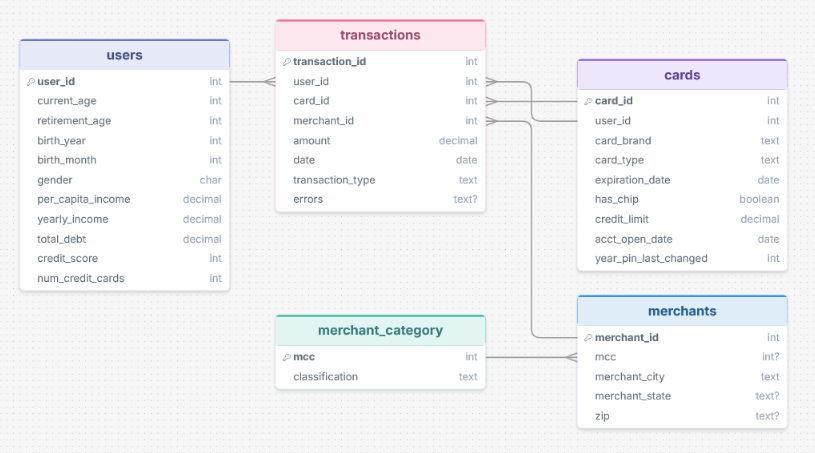

# Payment Transactions ETL Pipeline

A Python-based ETL pipeline that extracts transaction data, cleans and transforms it, and loads it into a PostgreSQL database for analysis in Power BI.

## Overview

I built this project to strengthen my data engineering skills using tools commonly required in the field (Python, SQL, and PostgreSQL) while working with a dataset large and messy enough to require real design decisions, not just a straightforward load. I chose a financial transactions dataset specifically because of my background as an Account Executive at a fintech company offering payment gateway solutions, which gave me useful context for interpreting and cleaning this kind of data.

## Architecture

Raw CSV/JSON files are extracted using pandas, cleaned and reshaped through a series of transform functions (type casting, deduplication, unit standardization), then loaded into a PostgreSQL snowflake-schema database. A dedicated `COPY`-based bulk load is used for the largest fact table to keep load times reasonable. The full pipeline is orchestrated through `main.py` and logged at each stage.

**Entity-Relationship Diagram:**



## Tech Stack

- Python (pandas, SQLAlchemy, psycopg2)
- PostgreSQL — relational database
- pgAdmin — database administration/GUI tool


## Key Data Engineering Decisions

- **Excluded sensitive data.** Card numbers, CVVs, street-level addresses, and precise latitude/longitude were dropped from the schema. These fields carry privacy risk without adding real analytical value at this granularity, so excluding them was both a security-conscious and a practical modeling decision.

- **Engineered a merchants dimension table.** The source data had no standalone merchant table — merchant details were embedded directly in each transaction row. I extracted and deduplicated this into a dedicated `merchants` table (with a separate `merchant_category` table built from `mcc_codes.json`), normalizing the schema and removing redundant repetition from the fact table.

- **Resolved inconsistent merchant location data.** Some merchants showed up to 99 distinct "state" values which is impossible for a single US-based merchant, since the field mixed US state codes with international country names. Investigating further, I found the dataset explicitly flags online transactions (`merchant_city == "ONLINE"`). I used this to separate online merchants from physical ones, applying mode-based aggregation to resolve minor location inconsistencies for physical merchants, and handled the edge case of merchants with both physical and online activity by prioritizing their physical location.

- **Optimized the transactions load with PostgreSQL's `COPY`.** Initial loading via pandas' `to_sql()` took ~37.6 minutes for the ~13.3M-row transactions table. Switching to a `COPY`-based bulk load reduced this to ~6.2 minutes — an ~84% improvement — and is documented as a deliberate before/after optimization rather than a default choice.

## How to Run It

1. Clone the repository
   ```bash
   git clone https://github.com/dane-riyell/payment-transactions-etl-pipeline
   cd payment-transactions-etl
   ```
2. Create and activate a virtual environment, then install dependencies
   ```bash
   python -m venv venv
   source venv/bin/activate
   pip install -r requirements.txt
   ```
3. Set up your `.env` file with your PostgreSQL credentials
4. Download the dataset from [Kaggle](https://www.kaggle.com/datasets/computingvictor/transactions-fraud-datasets/data) into `data/raw/`
5. Run `sql/create_tables.sql` in pgAdmin against your database
6. Run the pipeline
   ```bash
   python main.py
   ```

## Known Limitations / Future Improvements

- No incremental loading — each run assumes a full reload (optional truncate step included)
- No automated tests yet
- Currently designed for a single local PostgreSQL instance

## Data Source

[Financial Transactions Dataset: Analytics – Kaggle](https://www.kaggle.com/datasets/computingvictor/transactions-fraud-datasets/data)